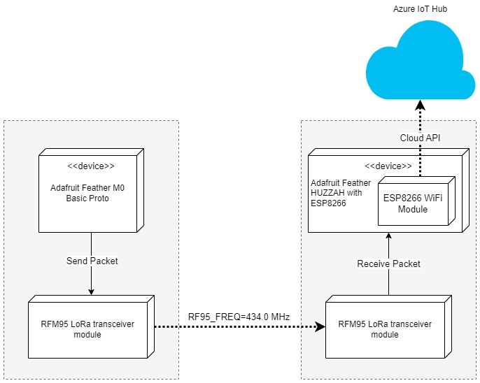

#  Azure IoT - Solar Panel Project

The requirement for this project was to gather data from an INA219 sensor, specifically shunt voltage, bus voltage and current for a solar panel, battery and LED. Moreover, it was also required to get INA169 current reading as well as the temperature near the panel. The idea was to upload the collected data to Azure IoT hub and visualize it with Power BI. That required an Internet connection, but the panel was placed far away where it was out of reach of any available network. To solve the problem, I decided to use the LoRa modules. 

This project consists of two microcontrollers:
1. **Adafruit Feather M0 Basic Proto** - placed at location of solar panel.
2. **Adafruit Feather HUZZAH with ESP8266** - placed at location where WiFi network was available.

Only MC (2) was supposed to be accessing the cloud, so it needed the WiFi module. To get the data from MC (1), two **RFM95 LoRa** transceiver modules were used for data exchange. MC (1) would perform readings at some specific intervals, serialize all the data, and finally send it as a binary stream to MC (2). The MC (2) would receive the data, deserialize it and push it to the cloud in JSON. 

